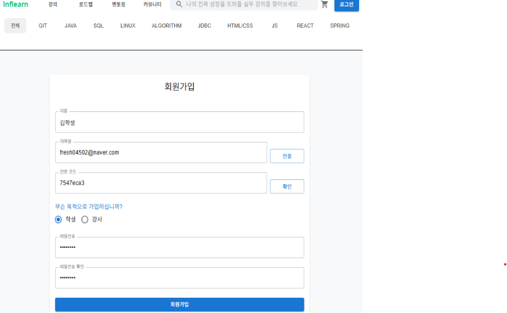
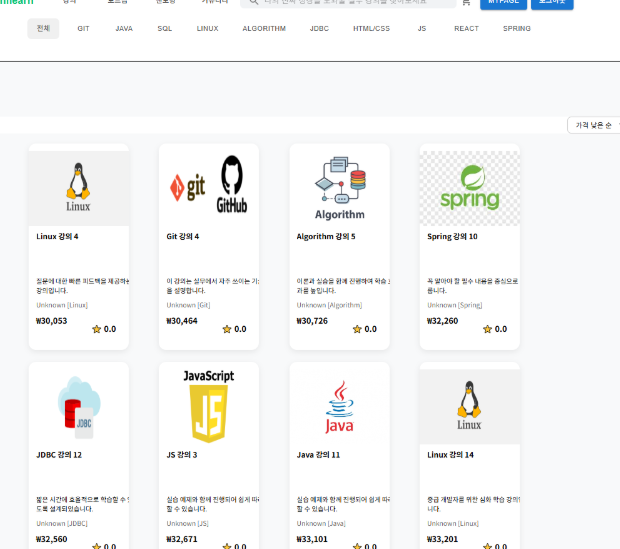
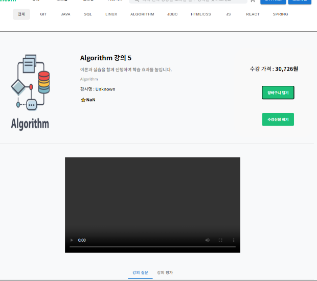
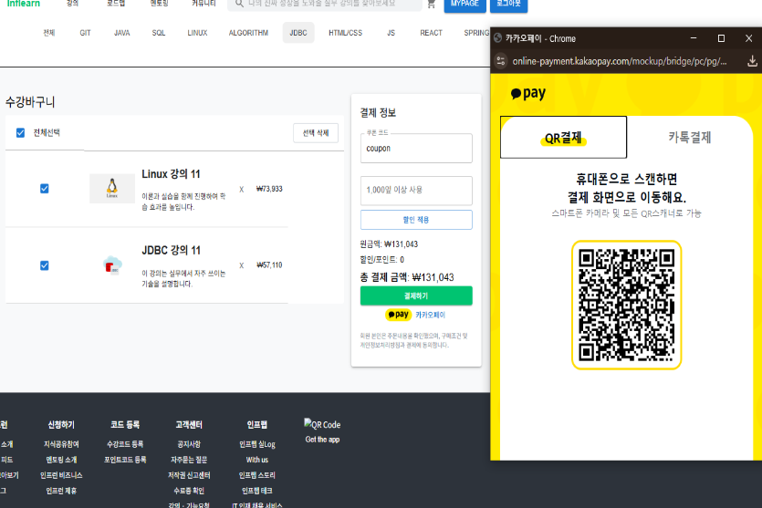
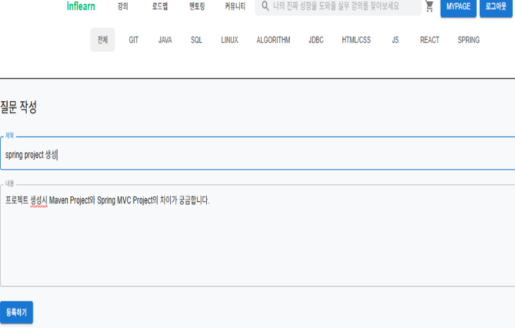
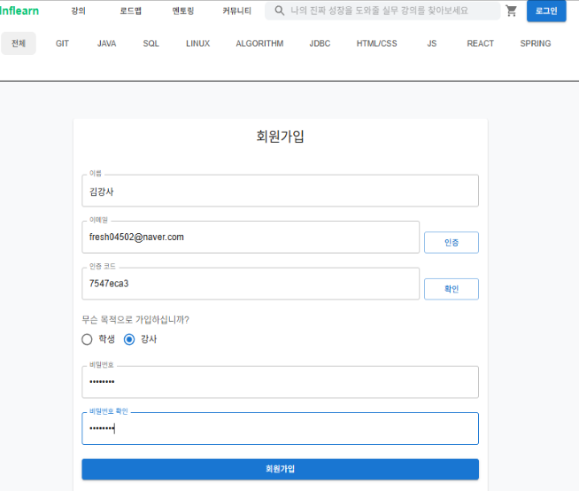
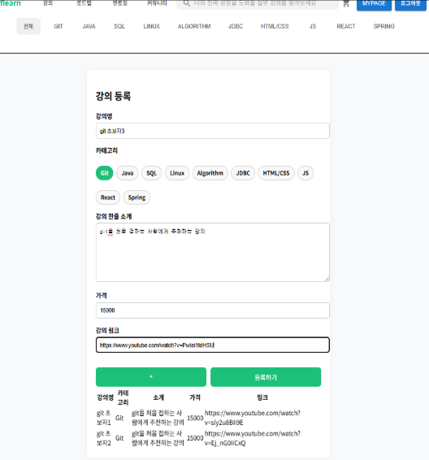
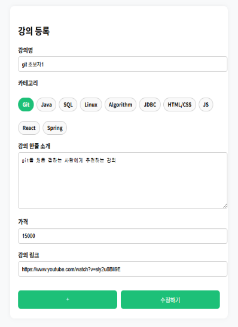
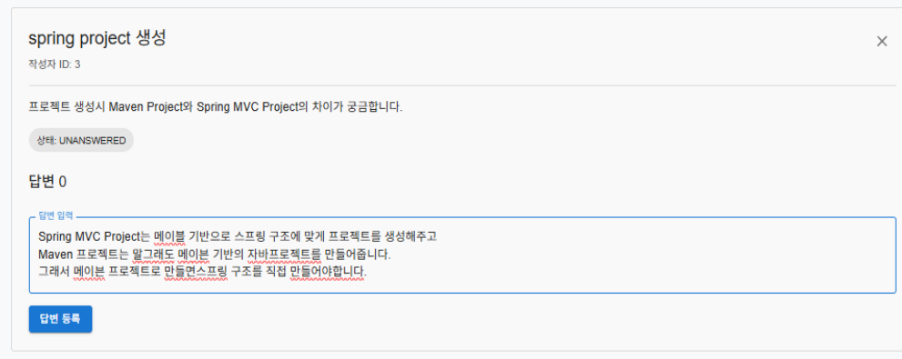

# 📚 Front Inflearn

> 📌 **Inflearn**은 온라인 강의 등록부터 결제, 댓글 소통까지 가능한 **학습 관리 플랫폼**입니다.  
> 본 레포지토리는 해당 서비스의 **프론트엔드 코드**를 포함하고 있으며, React(JSX)와 SCSS 기반으로 제작되었습니다.

## 🧭 프로젝트 개요

- 📅 개발 기간: 2025.05.09 ~ 2025.05.15  
- 🏗️ 주요 역할: 강의서비스 구현(백엔드 + 프론트)
- 🪄 GitHub Backend: [Backend Repository](https://github.com/kimjiwon0450/Back_inflearn_project)  

## ✨ 주요 기능 요약

| 사용자 유형 | 주요 기능 |
|------------|----------|
| 👩‍🎓 **일반 수강생(Student)** | 회원가입 및 로그인, 강의 조회/담기, 결제, 댓글 작성 |
| 👨‍🏫 **강사(Instructor)** | 강의 등록/수정/삭제, 댓글 답변 관리 |

---

## 👩‍🎓 일반 수강생 화면 미리보기

### 🔐 1️⃣ 로그인 및 회원가입
- 계정 생성 및 로그인, 인증 처리  
- 유효성 검사 및 로그인 유지 기능 포함

---

### 📚 2️⃣ 강의 조회 및 강의 담기
- 전체 강의 리스트 조회  
- 상세 페이지에서 장바구니 담기 가능

---

### 💳 3️⃣ 강의 결제
- 장바구니에서 결제 진행 및 결제 내역 확인 가능

---

### 💬 4️⃣ 댓글 작성
- 수강 완료 후 강의 댓글 작성  
- 댓글 수정/삭제 기능 제공

---

## 👨‍🏫 강사 화면 미리보기

### 🔐 1️⃣ 로그인 및 회원가입
- 강사 전용 로그인 및 권한 관리

---

### 🧑‍🏫 2️⃣ 강의 등록 / 수정 / 삭제
- 신규 강의 등록, 기존 강의 수정/삭제 기능 제공

---

### 💬 3️⃣ 댓글 답변 작성
- 수강생 댓글에 대한 답변 작성 및 관리

---

## 🛠️ 기술 스택

- **Language:** JavaScript (ES6+)  
- **Framework:** React  
- **Component Structure:** JSX 기반 컴포넌트 구조  
- **Styling:** SCSS
- **Routing:** React Router  
- **API 통신:** Axios  

---

## 📚 프로젝트를 통해 배운 점

- 사용자 권한(수강생/강사)에 따라 화면과 기능을 분리하면서 **권한 기반 UI 설계**를 깊이 있게 학습했습니다.  
- 특히 **프론트엔드와 백엔드 연동 시 변수명, 필드명 등을 사전에 명확히 정의하고 통일하는 것의 중요성**을 배웠습니다. 변수명이 일치하지 않으면 데이터가 제대로 매핑되지 않거나 오류가 발생하기 때문에, 초기 설계 단계에서 API 스펙을 정확히 협의하는 습관이 생겼습니다.

